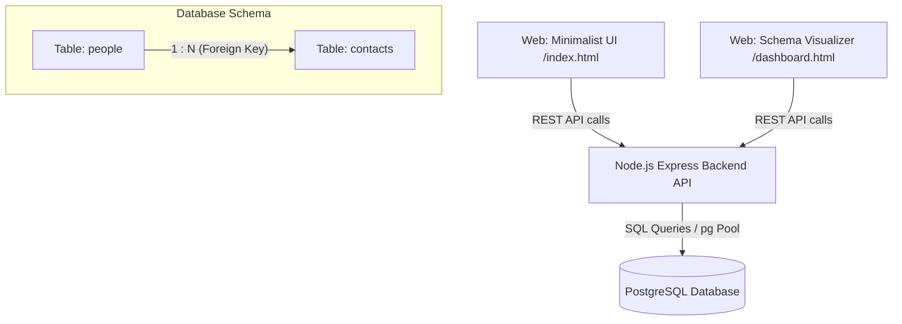

# Relational Contacts Database Application (Cloud-Ready)

A full-stack contact manager application demonstrating a PostgreSQL relational schema. It links a `people` table to a `contacts` table (1-to-many relationship) using a Node.js/Express API, with two distinct frontend user interfaces served from the backend.

---

## 🎨 Dual-Frontend Architecture

This project includes two separate web interfaces to suit different needs:

1. **Minimalist UI (Default Homepage)**:
   * Accessible at: **`http://localhost:5000/`** (or **`/index.html`**)
   * An ultra-clean, mobile-friendly interface designed for daily use.
   * Features searchable collapsible rows (accordions) showing name data and linked contact channels, with floating action buttons and modal overlays to add and manage profiles.
2. **Database Schema Visualizer (Dashboard)**:
   * Accessible at: **`http://localhost:5000/dashboard.html`**
   * A developer-oriented, glassmorphic layout displaying statistics, an interactive database schema connector map (PK/FK links), and a live Raw Table Inspector to view raw JSON rows stored inside PostgreSQL.

---

## 🏗️ System Flow



---

## ☁️ Deploy to the Web for Free (Render Blueprint)

This repository includes a `render.yaml` file that allows you to deploy both the database and the backend service (which serves the frontend UI) directly to the web on Render:

1. Push your project code to a repository on **GitHub** or **GitLab**.
2. Sign up or log in to **[Render.com](https://render.com)**.
3. In the Render Dashboard, click **New** -> **Blueprint**.
4. Select your repository.
5. Render will automatically parse the `render.yaml` configuration and propose spinning up:
   * A private **PostgreSQL database instance** (`contacts-db`).
   * A **Node.js Web Service** (`contacts-api-service`) connected to the database.
6. Click **Approve / Deploy**. 
7. Once Render finishes building the containers, it will give you a public web URL (e.g. `https://contacts-api-service.onrender.com`) where you and others can access the minimalist UI from anywhere on the internet!

---

## 🐳 Run Locally with Docker Compose

If you have Docker installed and running on your local machine:

1. Open your terminal in this directory and run:
   ```bash
   docker compose up --build
   ```
2. Once container logs stabilize, open your browser and navigate to:
   **[http://localhost:5000](http://localhost:5000)** (or **[http://localhost:5000/dashboard.html](http://localhost:5000/dashboard.html)**)

---

## 🛠️ Run Locally (Manual Node & PostgreSQL)

If you prefer to run PostgreSQL on your host machine directly:

1. **Start PostgreSQL**: Ensure your local PostgreSQL service is running.
2. **Create Database**: Open a client (like pgAdmin, psql, or DBeaver) and run:
   ```sql
   CREATE DATABASE contacts_db;
   ```
3. **Configure Connection**: Adjust variables in the [.env](file:///C:/Users/atala/.gemini/antigravity/scratch/contacts-db-app/.env) file:
   ```env
   PORT=5000
   PGHOST=localhost
   PGPORT=5432
   PGUSER=postgres
   PGPASSWORD=postgres
   PGDATABASE=contacts_db
   ```
4. **Install Dependencies**:
   ```bash
   npm install
   ```
5. **Seed the Database**: Automatically create the relational tables and populate 10 diverse records:
   ```bash
   npm run seed
   ```
6. **Start the API Server**:
   ```bash
   npm start
   ```
7. Access the app in your browser at **[http://localhost:5000](http://localhost:5000)**.
